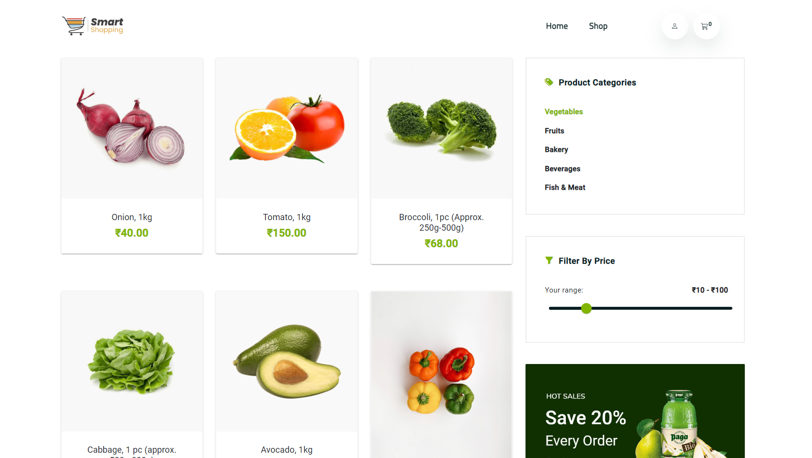
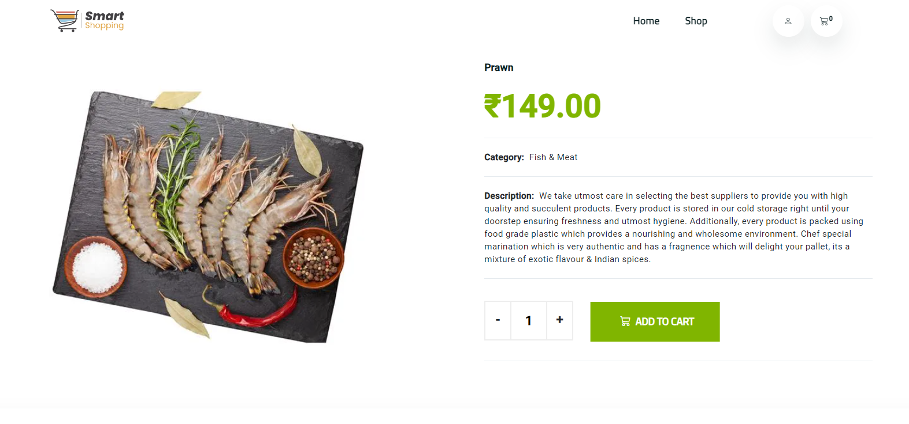
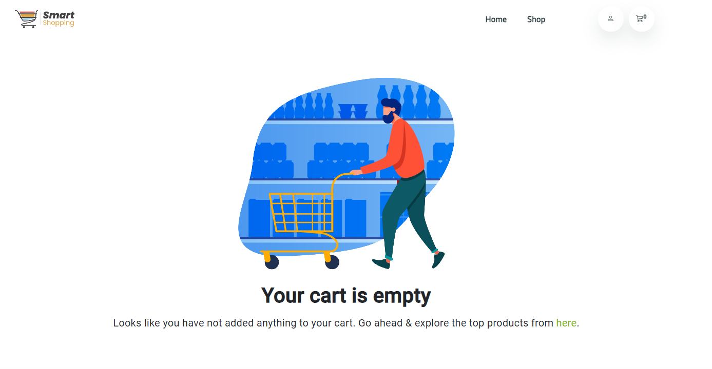
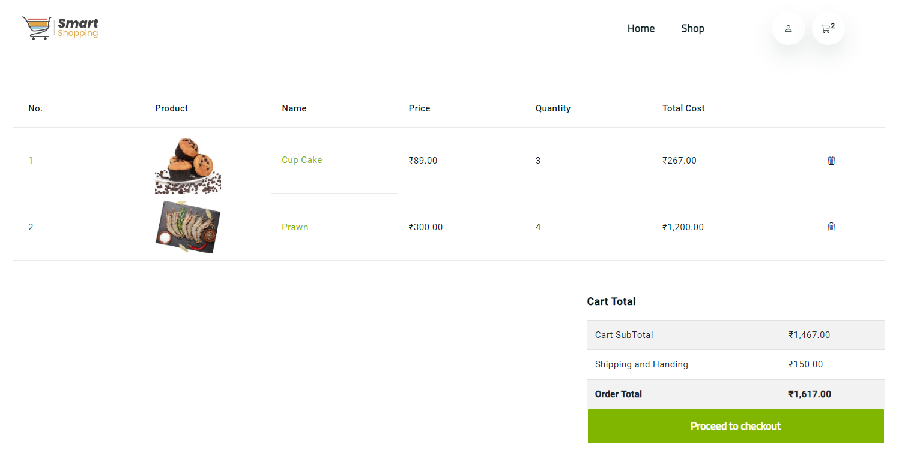
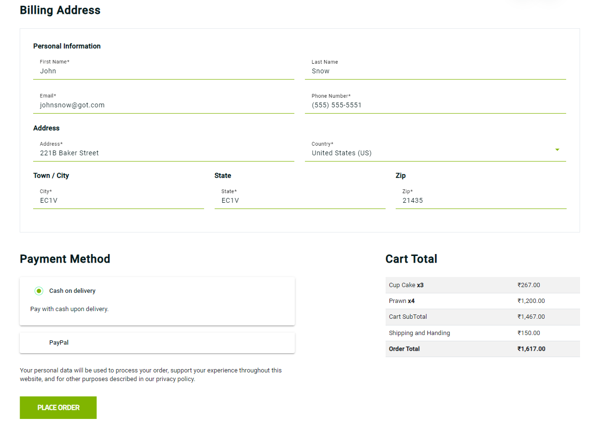
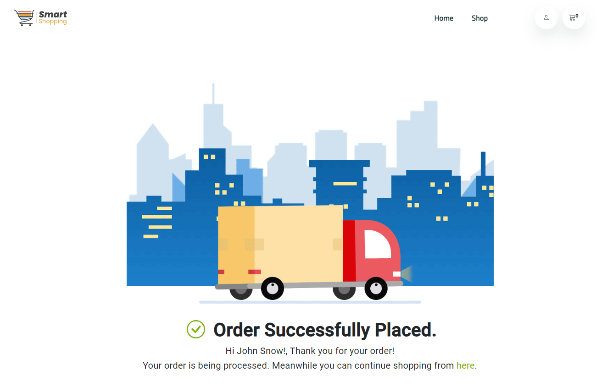

# Store Frontend

This project was generated with [Angular CLI](https://github.com/angular/angular-cli) version 16.1.0.

## Running this application
    1. Clone this repository from `git clone https://github.com/renurevzranju/angular-store.git`
    2. Go to the project directory `cd cd angular-store\frontend`
    3. Run `npm install` to install the dependencies
    4. Run `ng serve --open` to start the server. --open will automatically open the browser and navigates to `http://localhost:4200/`
    5. Explore the application

## About

MyStore is a single-page application built in Angular, that offers a rich, dynamic experience on the web. It presents a list of product which can be added to a cart then checkout.This application has Auth0 login/signUp enabled and uses lazy routing technique. Below are all the functionality one can perform:

-View list of products
-Add products to cart
-View products in cart
-Delete product from cart
-Checkout products in cart

## Page Preview
### Home page
-User can navigate to the products page using the Shop menu in the header. Click on the user icon to login to the application. AuthGuard has been enabled for the Products and Cart page.

### Product Details
-User can view the name, category and description of the product, add the product to cart by clicking on the Add to Cart button. Click on the Plus icon to increase and minus to decrease the quantity before adding the product to cart.

### Cart Page
If no products are added to cart, then the above page will be visible.

Once User add the product to the cart, the cart icon in the header will keep on updating the count and also the product will be displayed in the table format. User can delete the product and also update the quantity by clicking on the name of the product.

### Checkout
User has to provide the billing address details in the form which will be validated and only if the form is valid, User will be able to click on the place order.

Once the order is placed, the cart will be emptied and the order status will be updated accordingly.

